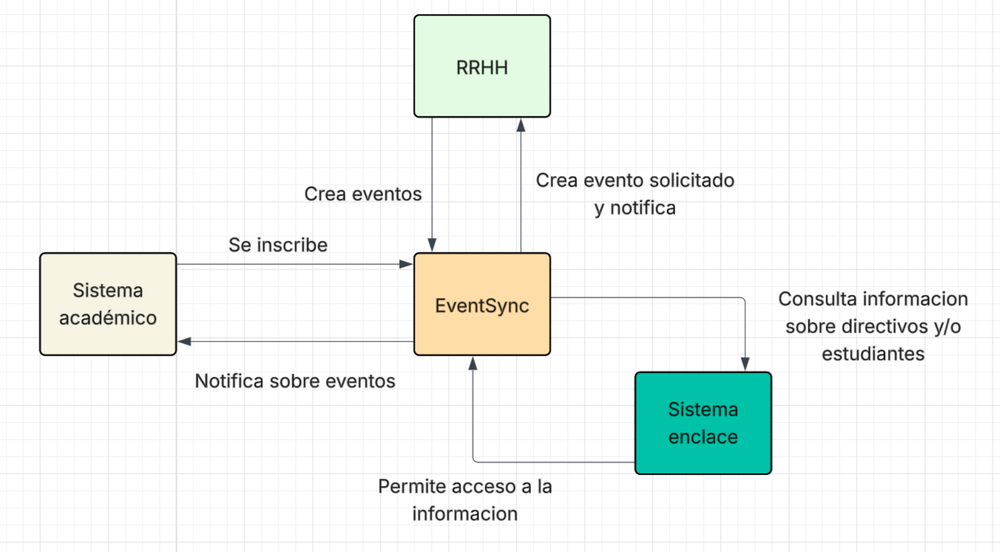
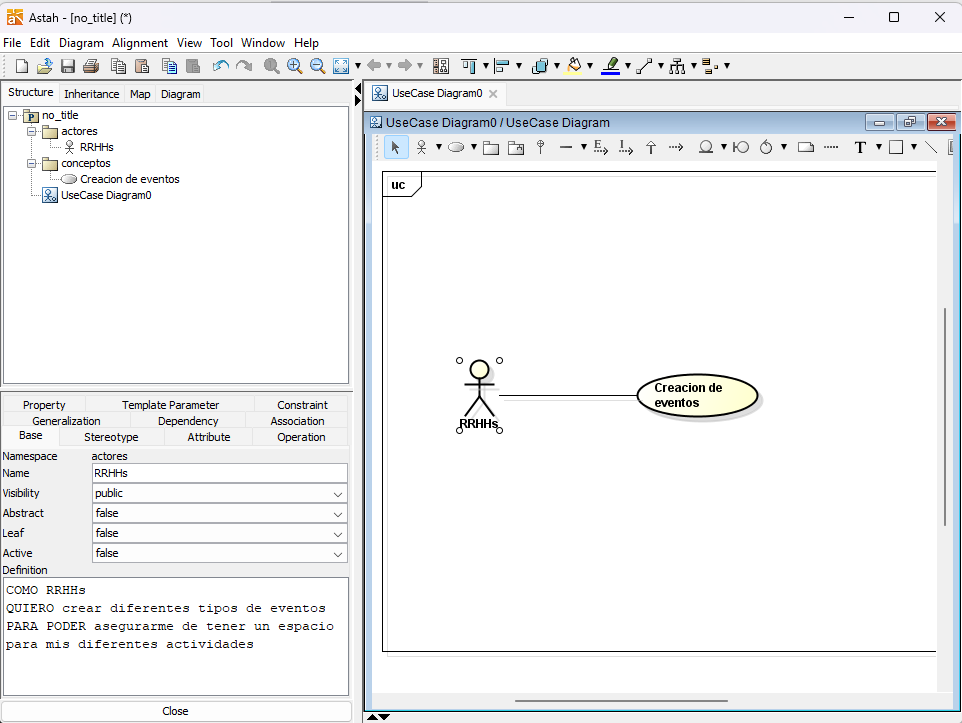
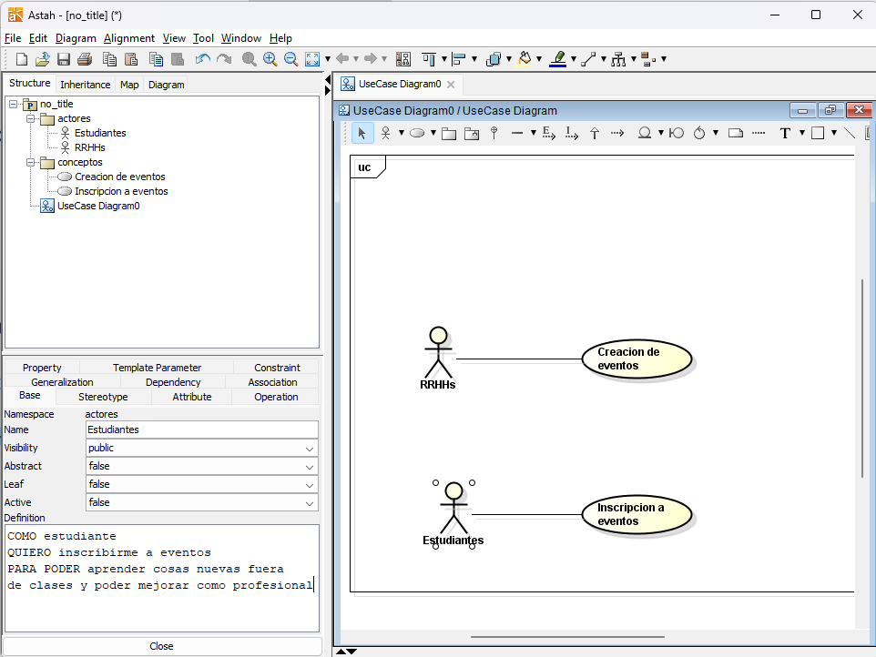

# Parcial T1 - DOSW

**Juan Diego Patino Munoz**

## Punto 1
>  Realice el diagrama de contexto con las generalidades de su sistema.  (Añadirlo al README.md)

nota: Por sistema academico me refiero a los estudiantes nada mas asi como decia en el pdf

---

## Punto 2

> Identifique 2 patrones de diseño que puedan aplicarse al caso de estudio, especificando por cada uno:
>
> a. Nombre del Patrón
>
> b. Tipo de patrón (creacional, estructural o de comportamiento).
>
> c. Justificación de la decisión.

### Patron 1

**Patron Factory Method**

**Tipo de patron**: Creacional.

**Justificacion**: Dado que el sistema debe gestionar multiples eventos (Conferencias, Talleres, Hackathon) que, aunque comparten
cosas en comun (atributos) tiene reglas de creacion especificos (por ejemplo quien los puede crear). Por ende el uso del *Factory method*
permite centralizar la logica de creacion de los eventos facilitandpo la extension si es que en un futuro se creace un nuevo tipo de evento.

### Patron 2

**Patron Strategy**

**Tipo de patron**: De comportamiento

**Justificacion**: se necesita validar reglas de negocio muy diferentes en los diferentes tipos de eventos, por ejemplo, la _conferencia_ tiene una
duracion max de 180 min y solo permite a profes y estudiantes, los _talleres_ tienen una duracion de 240 min y solo pueden ser profes o admins.
Al aplicar Strategy se puede definir una interfaz de y crear una estrategia concreta para cada tipo de evento. 

---

## Punto 3

> Identifique 5 requerimientos del sistema y clasifíquelos en funcionales (3) y no funcionales (2). Garantiza que al menos un requerimiento funcional seleccionado utilice un patrón identificado. (Añadirlo al README.md)

### RF-1
El sistema debe permitir la creacion de eventos por parte de _RRHH_ (**Factory Method**)

### RF-2
El sistema debe validar los tiempos maximos asociados con los tipos de eventos (**Strategy**)

### RF-3
El sistema debe proveer una manera de informar (notificar) tanto a _RRHH_ como a el _sistema academico_

### RNF-4
La interfaz debe ser responsive

### RNF-5
La interfaz debe tener colores pastel

---

## Punto 4

### Historia de uso para RRHHs (factory method)

### Historia de uso para estudiantes

